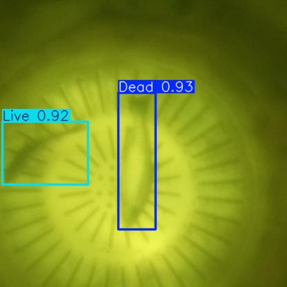
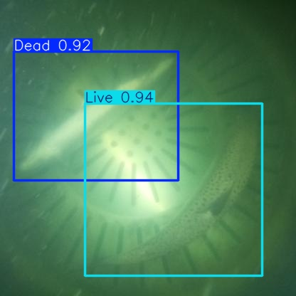
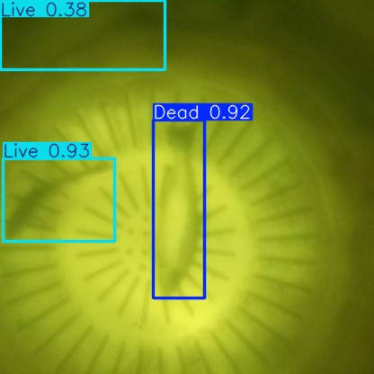
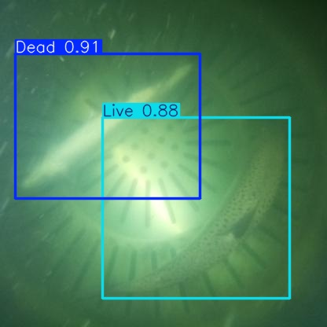

# RAS-MortDB: Fish Mortality Detection Dataset and Model Weights

[](https://creativecommons.org/licenses/by/4.0/)
[](https://doi.org/10.5281/zenodo.20631781)

## Overview

RAS-MortDB is a publicly available fish mortality detection dataset and model repository supporting the following peer-reviewed study:

> Ranjan, R.; Kothawade, G.S.; Sharrer, K.; Tsukuda, S.; Good, C. Does YOLO26 Truly Offer Advantages Over Its Predecessors for Edge Deployment in Aquaculture? A Benchmark Study. *AI* 2026 (under review).

The dataset comprises 2,000 annotated images of dead and live fish collected from a semi-commercial recirculating aquaculture system (RAS) over a 90-day deployment period under ambient and supplemental lighting conditions. Trained model weights for twelve Ultralytics YOLO architectures (YOLO26, YOLO11, YOLOv8, YOLOv5) across three size tiers (nano, small, medium) are provided in PyTorch (.pt) and ONNX (.onnx) formats.

---

## Repository Structure


```
RAS-MortDB/
├── dataset/               # 2,000 annotated images (YOLO format)
│   ├── train/             # 1,400 original + 1,400 augmented (2,800 total)
│   ├── valid/             # 400 images
│   ├── test/              # 200 images
│   └── data.yaml          # Dataset configuration
├── weights/
│   ├── pytorch/           # 12 x PyTorch model weights (.pt)
│   └── onnx/              # 12 x ONNX model weights (.onnx)
├── training_configs/      # args.yaml for all 84 training runs
├── inference/
│   └── run_inference.py   # Example inference script
├── docs/assets/           # Sample detection images
├── CITATION.cff
└── LICENSE
```

---

## Dataset

| Property | Details |
|---|---|
| Total images | 2,000 |
| Classes | Dead, Live |
| Split | 70:20:10 (train:valid:test) |
| Annotation format | YOLO (.txt) |
| Lighting conditions | Ambient and supplemental |
| Mortality levels | Zero, Low (<3 fish), High (≥3 fish) |
| Collection period | 90 days |
| Species | Atlantic salmon (*Salmo salar*) |
| Facility | Semi-commercial RAS grow-out tank |

---

## Model Performance (Full Dataset)

All models trained on NVIDIA A100-SXM4-80GB (USDA SCINet Atlas) using Ultralytics v8.4.24. Evaluated on 200-image held-out test set.

| Model | Tier | mAP50 (%) | mAP50-95 (%) | PT (MB) | ONNX (MB) |
|---|---|---|---|---|---|
| YOLO26n | Nano | 94.32 | 71.27 | 5.4 | 9.8 |
| YOLO11n | Nano | 94.21 | 70.93 | 5.5 | 10.6 |
| YOLOv8n | Nano | 94.51 | 69.40 | 6.3 | 12.3 |
| YOLOv5nu | Nano | 94.10 | 68.48 | 5.3 | 10.3 |
| YOLO26s | Small | 94.47 | 72.12 | 20.3 | 38.2 |
| YOLO11s | Small | 94.46 | 71.96 | 19.2 | 37.9 |
| YOLOv8s | Small | 94.46 | 69.70 | 22.5 | 44.7 |
| YOLOv5su | Small | 94.03 | 70.34 | 18.5 | 36.7 |
| YOLO26m | Medium | 94.40 | 71.81 | 44.0 | 81.7 |
| YOLO11m | Medium | 94.81 | 71.63 | 40.5 | 80.4 |
| YOLOv8m | Medium | 93.77 | 71.19 | 52.0 | 103.6 |
| YOLOv5mu | Medium | 94.65 | 70.97 | 50.5 | 100.5 |

---

## Edge Inference Performance (Raspberry Pi 5)

Benchmarked using ONNX Runtime 1.24.4 with CPUExecutionProvider on 200 test images following three warm-up runs.

| Model | Tier | Avg (ms) | FPS | CPU (%) | Peak RAM (MB) |
|---|---|---|---|---|---|
| YOLO26n | Nano | 133.2 | 7.51 | 49.8 | 530 |
| YOLO11n | Nano | 149.0 | 6.71 | 48.5 | 531 |
| YOLOv8n | Nano | 153.6 | 6.51 | 48.8 | 531 |
| YOLOv5nu | Nano | 139.2 | 7.19 | 48.8 | 531 |
| YOLO26s | Small | 345.2 | 2.90 | 49.9 | 626 |
| YOLO11s | Small | 358.9 | 2.79 | 49.5 | 626 |
| YOLOv8s | Small | 399.5 | 2.50 | 49.5 | 626 |
| YOLOv5su | Small | 348.0 | 2.87 | 49.4 | 626 |
| YOLO26m | Medium | 956.4 | 1.05 | 50.0 | 787 |
| YOLO11m | Medium | 959.5 | 1.04 | 49.8 | 787 |
| YOLOv8m | Medium | 944.7 | 1.06 | 49.8 | 787 |
| YOLOv5mu | Medium | 797.6 | 1.25 | 49.8 | 787 |

---

## Training Configuration

All models were trained under identical hyperparameters to ensure fair comparison. Complete training configuration files (args.yaml) for all 84 training runs are available in the training_configs/ directory, named by model and dataset size (e.g., yolov8n_2800imgs_args.yaml).

Key hyperparameters:

| Hyperparameter | Value |
|---|---|
| Epochs | 100 (early stopping patience: 50) |
| Batch size | 32 |
| Input image size | 640 × 640 px |
| Optimizer | auto (MuSGD for YOLO26; SGD for others) |
| Learning rate | 0.01 |
| Momentum | 0.937 |
| Weight decay | 0.0005 |
| Pretrained weights | MS COCO |
| Random seed | 0 |
| Framework | Ultralytics v8.4.24 |

---

## Quick Start

### Install dependencies

```bash
pip install ultralytics onnxruntime
```

### PyTorch inference

```python
from ultralytics import YOLO
model = YOLO("weights/pytorch/yolo26n_best.pt")
results = model.predict("your_image.jpg", conf=0.25)
results[0].show()
```

### ONNX inference (Raspberry Pi 5 / CPU)

```python
from ultralytics import YOLO
model = YOLO("weights/onnx/yolo26n.onnx")
results = model.predict("your_image.jpg", conf=0.25)
results[0].show()
```

### Edge inference benchmark

```bash
python3 inference/run_inference.py --image your_image.jpg \
  --model weights/onnx/yolo26n.onnx --conf 0.25
```

---

## Sample Detection Results

### YOLO26n Detections



### YOLOv8n Detections



---

## Citation

If you use RAS-MortDB in your research please cite:

**Paper:**

Ranjan, R.; Kothawade, G.S.; Sharrer, K.; Tsukuda, S.; Good, C.
Does YOLO26 Truly Offer Advantages Over Its Predecessors for Edge
Deployment in Aquaculture? A Benchmark Study. AI 2026 (under review).

**Dataset:**

Ranjan, R. (2026). RAS-MortDB: Fish Mortality Detection Dataset and
Model Weights for Recirculating Aquaculture Systems (v1.0.0) [Data set].
Zenodo. https://doi.org/10.5281/zenodo.20631781

---

## License

- **Dataset:** Creative Commons Attribution 4.0 (CC BY 4.0)
- **Model weights:** AGPL-3.0 (consistent with Ultralytics YOLO license)

---

## Contact

Rakesh Ranjan
The Conservation Fund Freshwater Institute
Email: rranjan@conservationfund.org