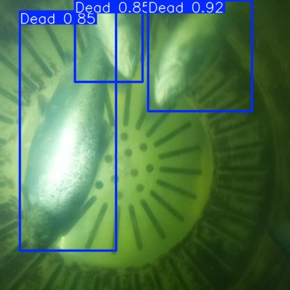
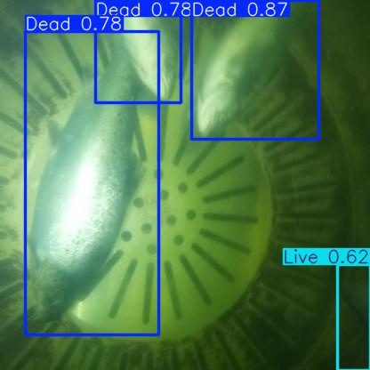
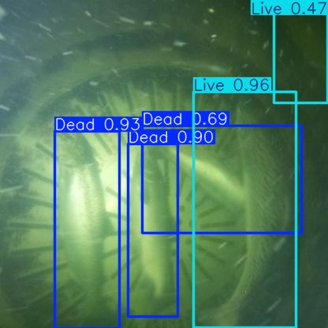
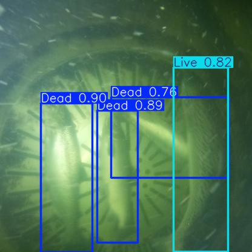

# RAS-MortDB: RAS Fish Mortality Detection Dataset and Model Weights


## Overview

RAS-MortDB is a publicly available RAS fish mortality detection dataset and model repository:

> Ranjan, R. et al. Does YOLO26 truly offer advantages over its predecessors for Edge-Deployed Object Detection? A Benchmark Case Study in Aquaculture (Paper under peer-review)


The dataset comprises 2,000 annotated images of dead and live fish collected from a semi-commercial RAS over a 90-day deployment period under ambient and supplemental lighting conditions. Trained model weights for twelve Ultralytics YOLO architectures across three size tiers are provided in PyTorch (.pt) and ONNX (.onnx) formats.


## Sample Detection Results


Comparison of YOLO26n vs YOLOv8n detections on the same images:


| YOLO26n | YOLOv8n |

|:-------:|:-------:|

|  |  |

|  |  |

|  |  |

|  |  |


## Repository Structure

- dataset/        : 2,000 annotated images (train/valid/test split 70:20:10)

- weights/pytorch : 12 x PyTorch model weights (.pt)

- weights/onnx    : 12 x ONNX model weights (.onnx)

- inference/      : Example inference scripts


## Dataset

- Total images    : 2,000

- Classes         : Dead, Live

- Split           : 70:20:10 (train:valid:test)

- Annotation      : YOLO format (.txt)

- Lighting        : Ambient and supplemental

- Mortality levels: Zero, Low (<3 fish), High (>=3 fish)

- Collection      : 90-day commercial RAS deployment


## Quick Start

### PyTorch inference

```python

from ultralytics import YOLO

model = YOLO("weights/pytorch/yolo26n_best.pt")

results = model.predict("your_image.jpg", conf=0.25)

results[0].show()

```

### ONNX inference (Raspberry Pi / CPU)

```python

from ultralytics import YOLO

model = YOLO("weights/onnx/yolo26n.onnx")

results = model.predict("your_image.jpg", conf=0.25)

results[0].show()

```


## Citation

If you use RAS-MortDB, please cite:


    Ranjan, R. et al. Does YOLO26 NMS-Free Architecture Outperform

    Its Predecessors for Edge-Deployable Fish Mortality Monitoring

    in RAS? AI 2026. DOI: TBD


## License

- Dataset: Creative Commons Attribution 4.0 (CC BY 4.0)

- Model weights: AGPL-3.0 (consistent with Ultralytics YOLO license)


## Contact

Rakesh Ranjan

The Conservation Fund Freshwater Institute

Email: rranjan@conservationfund.org

